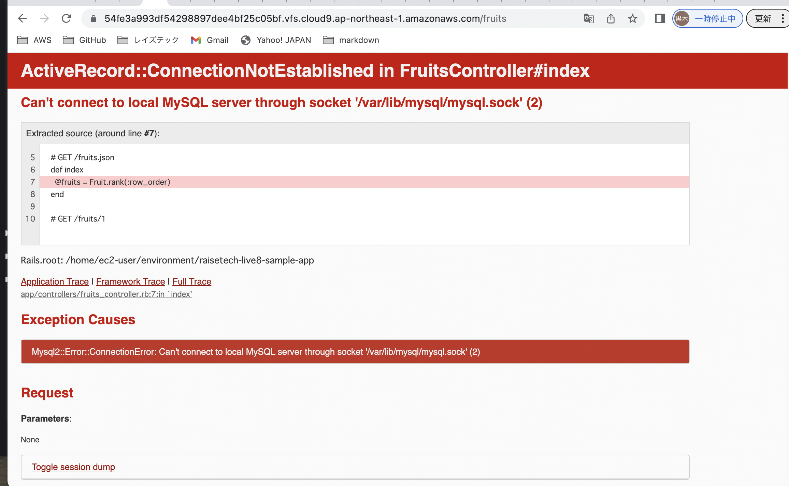

## 第3回課題
* APサーバー 
サーバー名：Puma  
バージョン：5.6.5 
* DBサーバー 
サーバー名：MySQL  
バージョン：8.0.33  
* Railsの構成管理ツール名  
bundle 
* 課題から学んだこと  
APサーバーを終了させるとアクセスできなくなる、 
APサーバーが起動していてもDBサーバーが終了していたら 
エラー画面になることがわかりました。 
 
 
 
 
 
