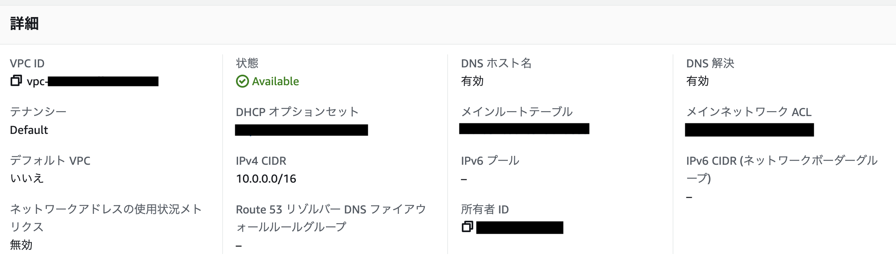
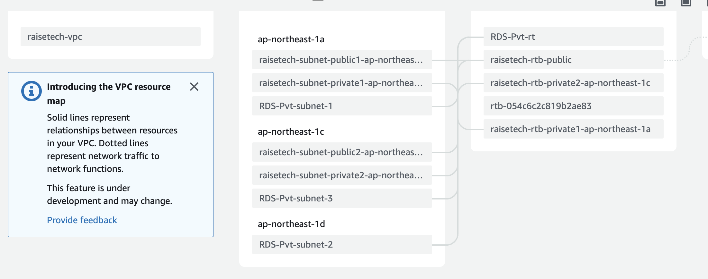
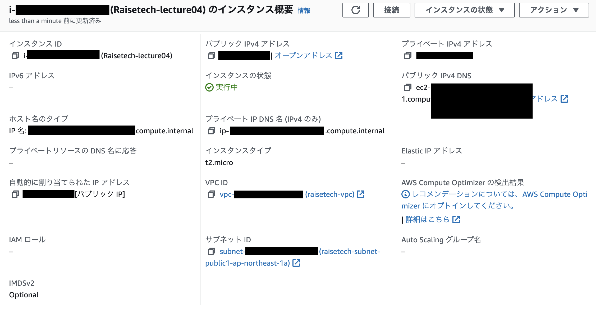
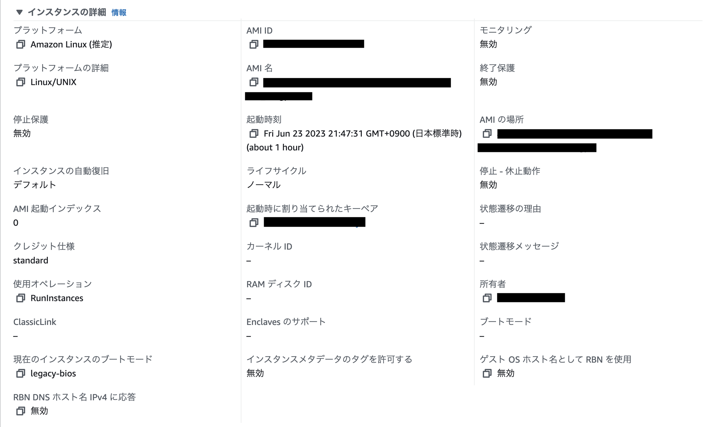
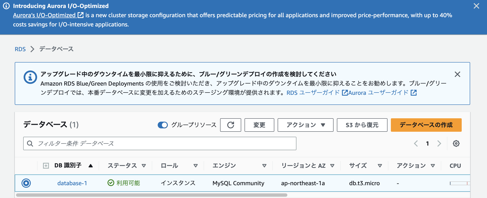
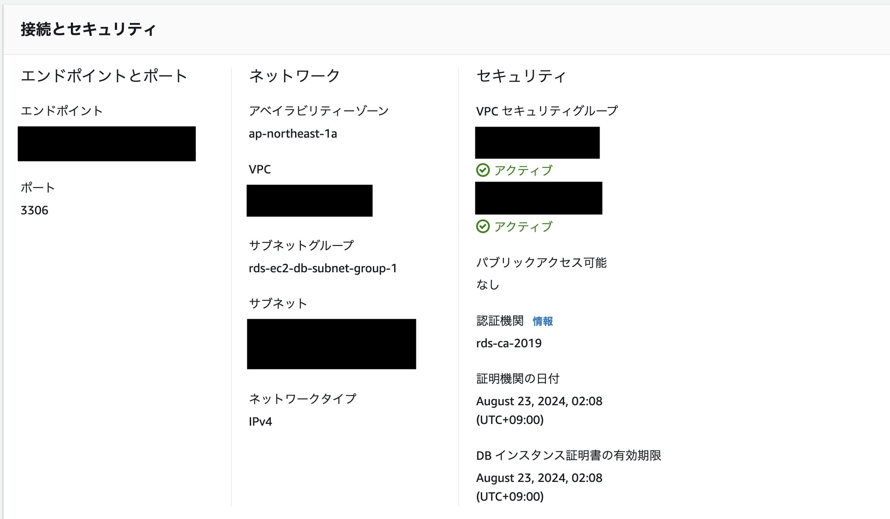
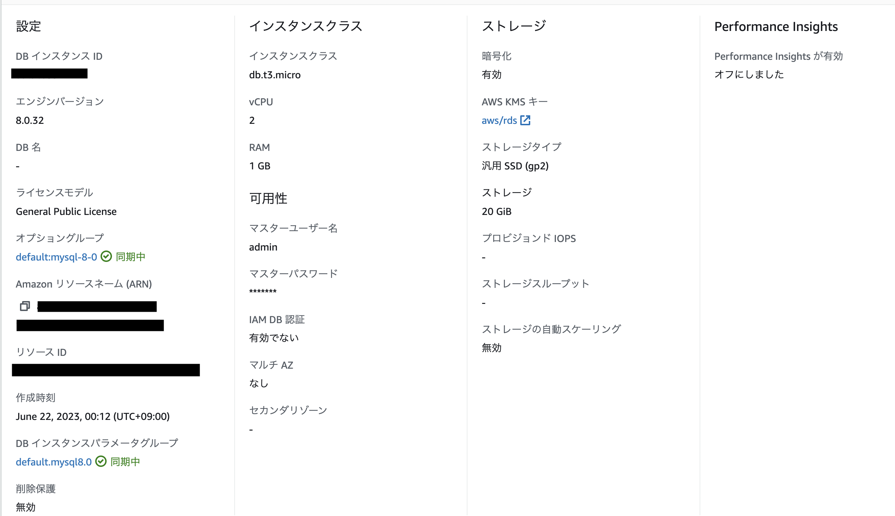
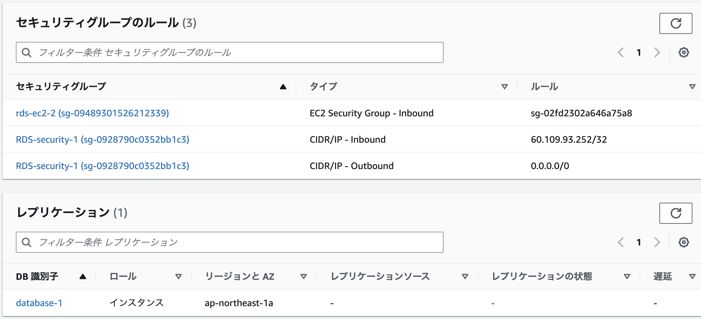
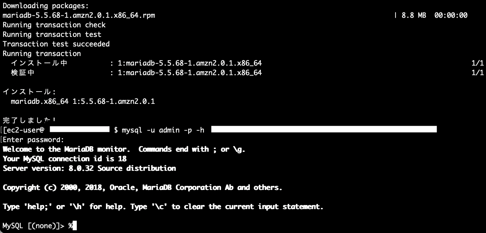

# 第4回課題

### VPC設定

### EC2設定

### RDS設定

### EC2にSSH接続

### EC2とRDS接続

### 課題から学んだこと

VPC 、EC 2、RDSの作成がどう設定していいか分からずに

時間がかかってしまいました。

SSHで接続は、コマンドが分からず、受講生の方に色々ご教授いただき

接続に成功できました。

mysplのインストールをしないとコマンドが見つかりませんとエラーになることも

今回学びました。

無事、EC 2とRDSが接続できて良かったです。